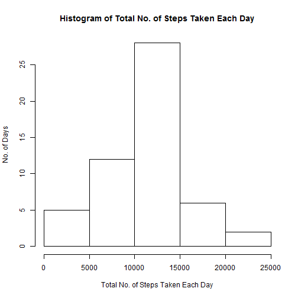
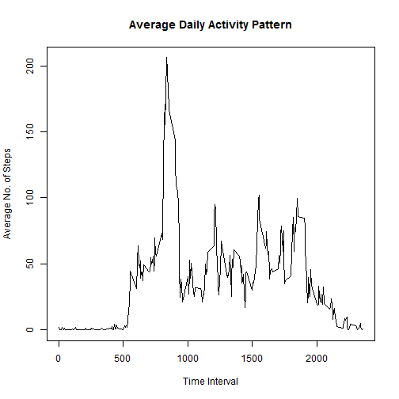
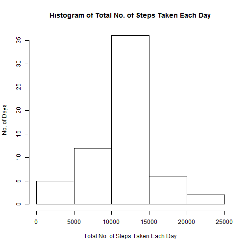
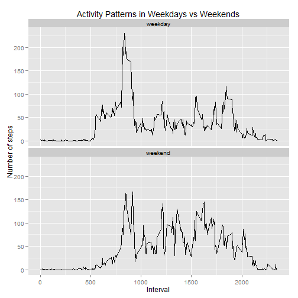

## Loading and preprocessing the data

Firstly, I load the data into a data table:


```r
if(!file.exists("activity.csv")){
        unzip("activity.zip")
}

data <- read.csv("activity.csv")
```

After loading the data, I briefly check the data:


```r
str(data)
```

```
## 'data.frame':	17568 obs. of  3 variables:
##  $ steps   : int  NA NA NA NA NA NA NA NA NA NA ...
##  $ date    : Factor w/ 61 levels "2012-10-01","2012-10-02",..: 1 1 1 1 1 1 1 1 1 1 ...
##  $ interval: int  0 5 10 15 20 25 30 35 40 45 ...
```

  
## What is mean total number of steps taken per day?

Firstly, I sum up the number of steps by date:


```r
totalSteps <- aggregate(steps~date, data, sum)
```

Next, I show a histogram of the total number of steps taken each day:


```r
hist(totalSteps$steps, xlab="Total No. of Steps Taken Each Day", 
     ylab="No. of Days", main="Histogram of Total No. of Steps Taken Each Day")
```

 

Then I find the mean and median of the total number of steps per day:


```r
meanStepsPerDay <- mean(totalSteps$steps, na.rm=TRUE)
medianStepsPerDay <- median(totalSteps$steps, na.rm=TRUE)

## Rounding up the mean and median to nearest whole number
meanStepsPerDay <- round(meanStepsPerDay)
medianStepsPerDay <- round(medianStepsPerDay)
```

The mean total number of steps taken per day is 10766.  
The median total number of steps taken per day is 10765.

  
## What is the average daily activity pattern?

Firstly, I need to find the average number of steps for each time interval:


```r
averageSteps <- aggregate(steps~interval, data, mean)
```

Next, I make a time series plot of the 5-minute interval and the average number of steps taken, averaged across all days:


```r
plot(averageSteps$interval, averageSteps$steps, type="l", xlab="Time Interval", 
     ylab="Average No. of Steps", main="Average Daily Activity Pattern")
```

 

To determine which interval has the most number of steps (on average):


```r
## Generate the index of the interval which has the most number of steps in 
## averageSteps data table
mostSteps <- which.max(averageSteps$steps)

## Display the row where the interval has the most number of steps in 
## averageSteps data table
averageSteps[mostSteps,]
```

```
##     interval  steps
## 104      835 206.17
```

Therefore, the 835th interval contains the maximum number of steps.

  
## Imputing missing values

To calculate the total number of missing values (ie. NAs) in the dataset:


```r
numberOfNA <- sum(is.na(data$steps))
```

Hence, the total number of missing values in the dataset is 2304.

Given that presence of missing values may introduce bias into some calculations or summaries of the data, my strategy is to assume the missing value of a particular 5-minute interval to be the value of the mean for that particular 5-minute interval.

With the assumption, I create a new dataset that is equal to the original dataset but with the missing data filled in (based on above strategy):


```r
newData <- data

for(i in 1:nrow(newData)){
        if(is.na(newData$steps[i])){
                newData$steps[i] <- 
                        averageSteps[which(newData$interval[i] 
                                           == averageSteps$interval),]$steps
        }
}

## check that newData is populated correctly
str(newData)
```

```
## 'data.frame':	17568 obs. of  3 variables:
##  $ steps   : num  1.717 0.3396 0.1321 0.1509 0.0755 ...
##  $ date    : Factor w/ 61 levels "2012-10-01","2012-10-02",..: 1 1 1 1 1 1 1 1 1 1 ...
##  $ interval: int  0 5 10 15 20 25 30 35 40 45 ...
```

```r
head(newData)
```

```
##      steps       date interval
## 1 1.716981 2012-10-01        0
## 2 0.339623 2012-10-01        5
## 3 0.132075 2012-10-01       10
## 4 0.150943 2012-10-01       15
## 5 0.075472 2012-10-01       20
## 6 2.094340 2012-10-01       25
```

I also check that there are no more missing values in the new dataset:


```r
sum(is.na(newData$steps))
```

```
## [1] 0
```

To verify if there is a difference in computation given there are no missing values, I perform the calculation of the mean and median values of the total number of steps per day again.

Firstly, I sum up the number of steps by date of the new dataset:


```r
newTotalSteps <- aggregate(steps~date, newData, sum)
```

Then, I show a histogram of the total number of steps taken each day based on the new dataset:


```r
hist(newTotalSteps$steps, xlab="Total No. of Steps Taken Each Day", 
     ylab="No. of Days", main="Histogram of Total No. of Steps Taken Each Day")
```

 

Next, I find the mean and median of the total number of steps per day based on the new dataset:


```r
newMeanStepsPerDay <- mean(newTotalSteps$steps, na.rm=TRUE)
newMedianStepsPerDay <- median(newTotalSteps$steps, na.rm=TRUE)

## Rounding up the mean and median to nearest whole number
newMeanStepsPerDay <- round(newMeanStepsPerDay)
newMedianStepsPerDay <- round(newMedianStepsPerDay)
```

The new mean total number of steps taken per day is 10766.  
The new median total number of steps taken per day is 10766.

Noticed that the median value increases slightly with the new dataset (as compared to the original dataset with missing values). Imputing missing data on the estimates of the total daily number of steps will minimise any form of bias  in computations of the data.

  
## Are there differences in activity patterns between weekdays and weekends?

Firstly, I introduce a new factor variable to the (new) dataset to differentiate if a date is weekday or weekend:


```r
## Convert the date variable (in newData) from Factor type to Date type
newData$date <- as.Date(newData$date)

## Create new variable
newData$day <- weekdays(newData$date)

## Update the new variable to a factor variable of 2 levels
newData$day <- as.factor(ifelse(newData$day %in% c("Monday","Tuesday",
                                                   "Wednesday","Thursday",
                                                   "Friday"), 
                      "weekday", "weekend"))

## Display the structure of newData 
str(newData)
```

```
## 'data.frame':	17568 obs. of  4 variables:
##  $ steps   : num  1.717 0.3396 0.1321 0.1509 0.0755 ...
##  $ date    : Date, format: "2012-10-01" "2012-10-01" ...
##  $ interval: int  0 5 10 15 20 25 30 35 40 45 ...
##  $ day     : Factor w/ 2 levels "weekday","weekend": 1 1 1 1 1 1 1 1 1 1 ...
```

Next, I need to find the average number of steps for each time interval by day:


```r
averageStepsByDay <- aggregate(steps~interval+day, newData, mean)
```

Finally, I show a panel plot of the 5-minute interval and the average number of steps taken, averaged across all weekday/weekend days:


```r
## Using ggplot for panel plotting
library(ggplot2)

ggplot(averageStepsByDay, aes(x=interval, y=steps)) + geom_line() + 
        facet_wrap(~day, nrow=2, ncol=1) + 
        labs(list(x="Interval", y="Number of steps", 
                  title="Activity Patterns in Weekdays vs Weekends"))
```

 

From the plot, I observe that activity in the weekends starts later whereas that in the weekdays starts earlier and spikes around the 800-900th interval.
